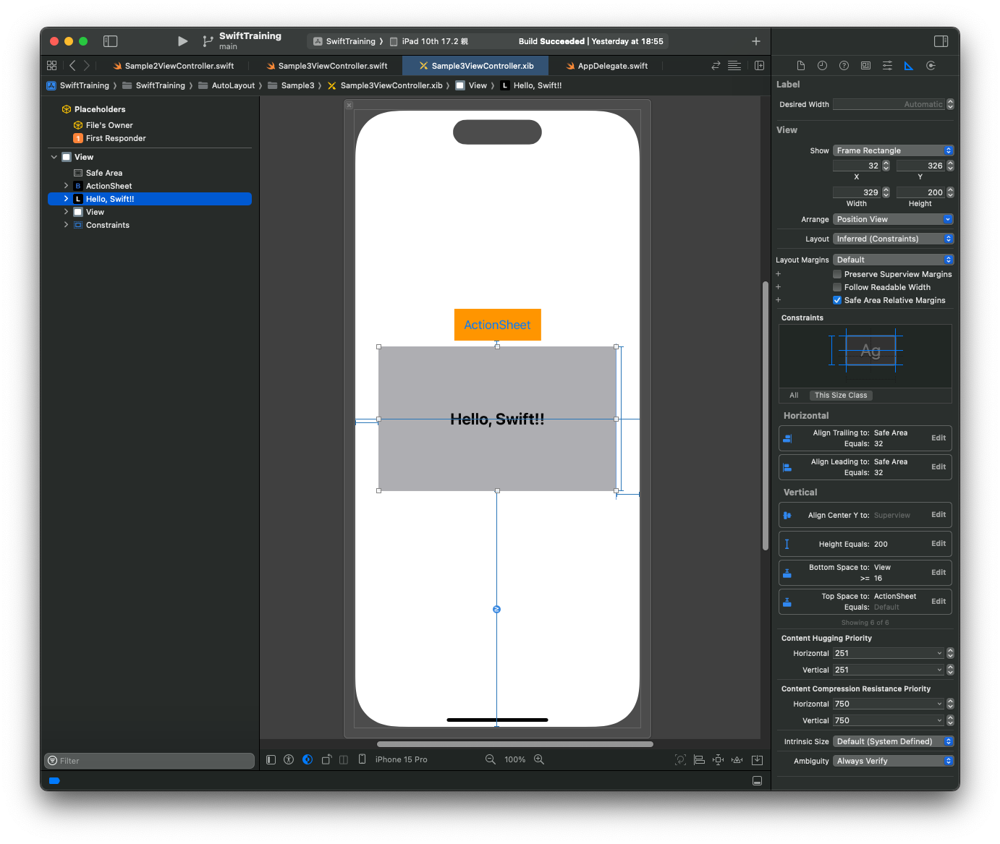
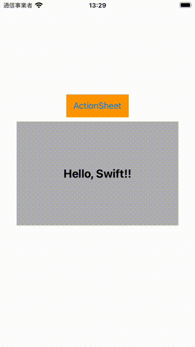
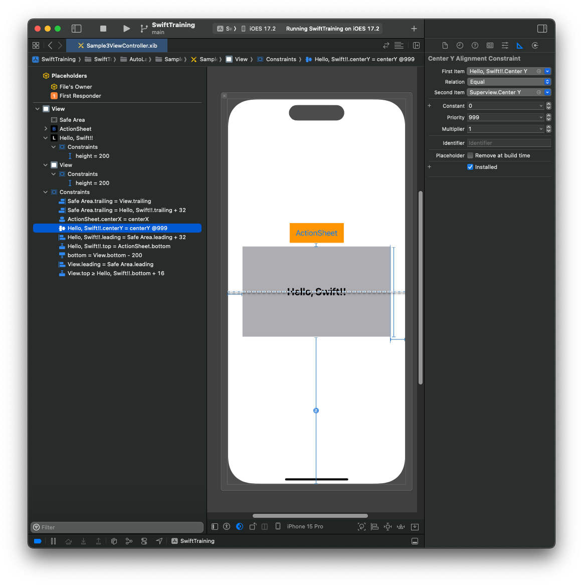
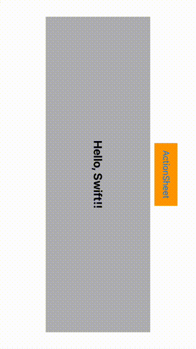
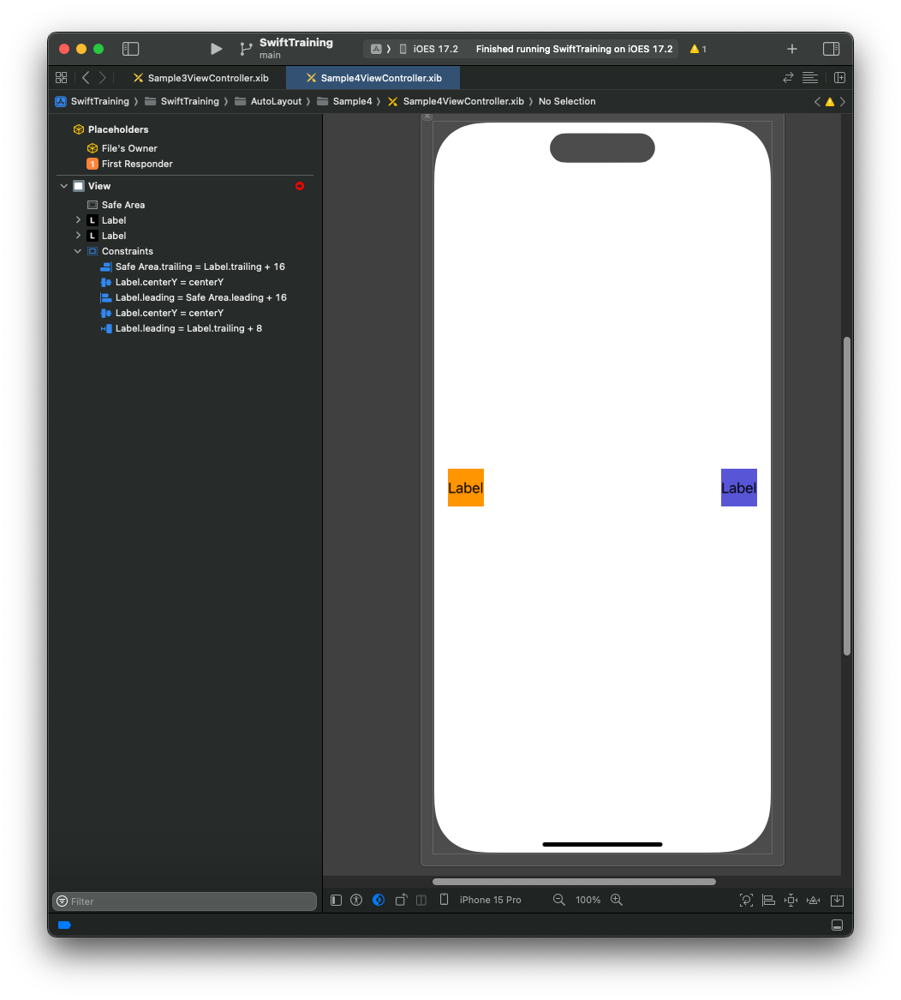
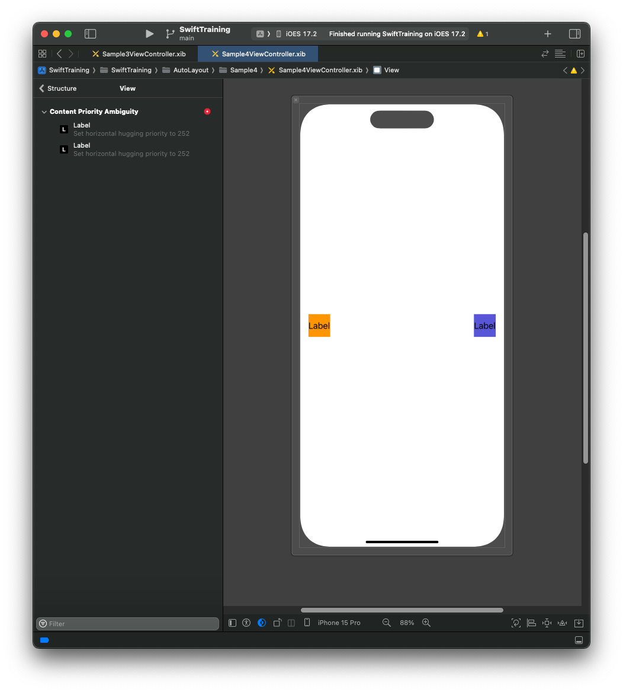
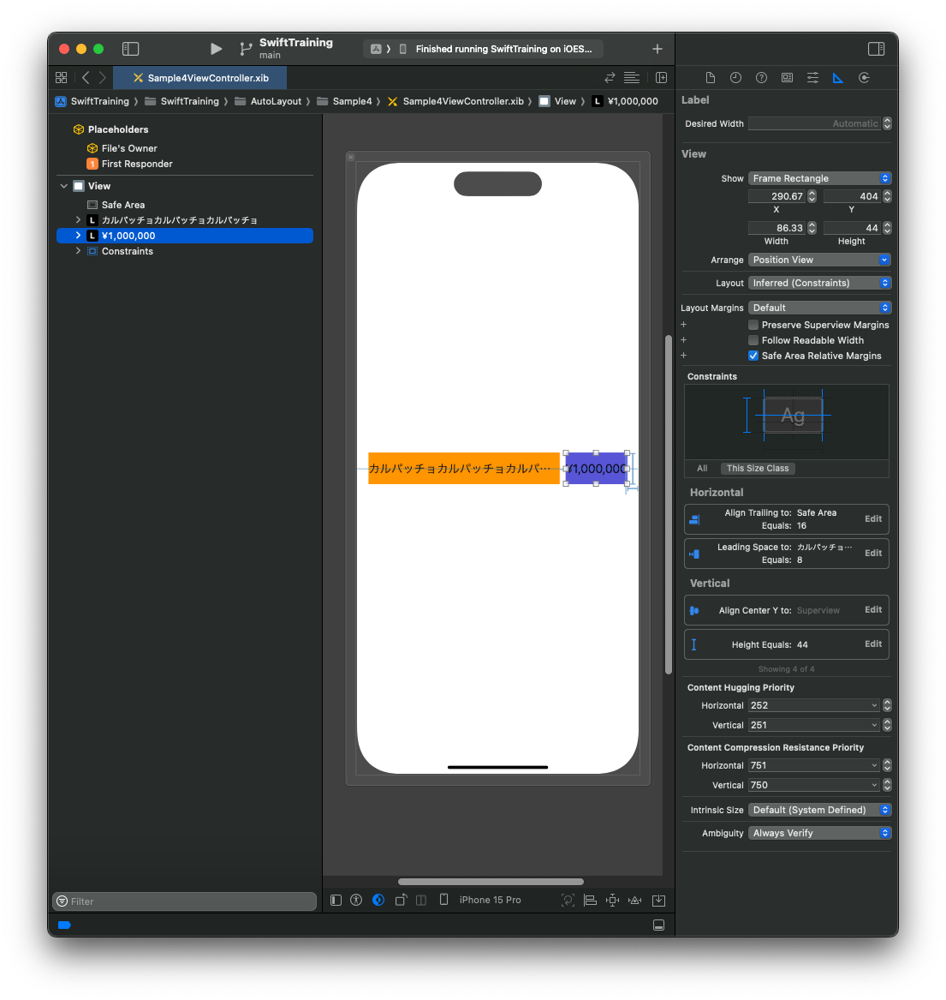
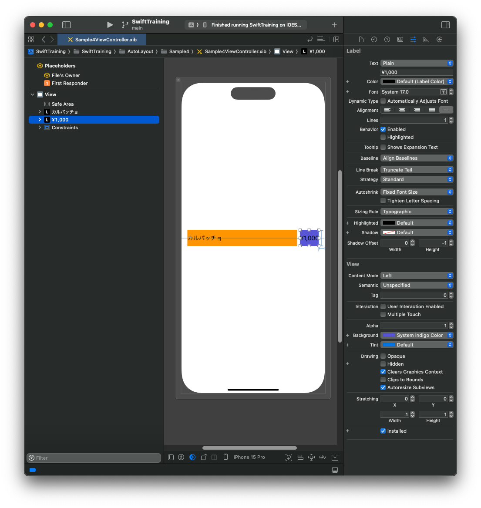

# AutoLayout

View のレイアウトを決定する仕組みのひとつに Auto Layout があります。  
制約(`NSLayoutConstraint`)を組み合わせて View のレイアウトを解決します。  
制約とは例えば`このViewの上辺は親のViewの上辺からXポイントあける`、`このViewとこのViewの幅は同じにする`
のようなものです。

Apple の Document  
[NSLayoutConstraint](https://developer.apple.com/documentation/uikit/nslayoutconstraint)  
[Auto Layout Guide](https://developer.apple.com/library/archive/documentation/UserExperience/Conceptual/AutolayoutPG/)

InterfaceBuilder で制約を与える方法、NSLayoutConstraint オブジェクトを使用してコードで制約を与える方法のほか、サードパーティのライブラリでコードから直感的に制約を与えられるものもあります。  
[SnapKit](https://github.com/SnapKit/SnapKit)

## 他の方法

iOS には他にもさまざまなレイアウトの指定方法がありますが、おおまかには AutoLayout とフレーム指定の 2 種類があります。

| 手法         | メリット                                                       | デメリット                                                       |
| ------------ | -------------------------------------------------------------- | ---------------------------------------------------------------- |
| AutoLayout   | 画面幅に応じた処理を書かなくて済む。回転も特に気にしなくて良い | 処理が遅い                                                       |
| フレーム指定 | AutoLayout と違いフレームの計算が入らない分処理が早い          | 画面幅、回転などを考慮して計算しなくてはいけないためとにかく大変 |

## 組み方の考え方

iOS の座標系は画面左上を原点とし原点の座標と横幅縦幅の CGRect で管理されています。

また親 View が存在する場合はその親 View の左上が子 View にとっての原点になります。
(これは、親 View からはみ出すようなレイアウトを組む際に重要になってきます)

AutoLayout でレイアウトを組む際は特殊な場合を除いて必ず 4 つの制約が必要になります。

制約が 5 個だったり、3 個だったりするものは何かおかしいので修正をしましょう。

よく使う組み方としては、

1. 左辺 x 軸
2. 上辺 y 軸
3. 右辺 x 軸
4. 縦幅

の指定や

1. 中心点 x 軸
1. 中心点 y 軸
1. 横幅
1. 縦幅

の指定です。上記は一例ですが、指定の仕方によって組みやすいレイアウトがあったりします。

例えば下図ではセンタライズする場合は中心点の指定が欲しくなります。（しなくてもできるが、座標の計算が必要になり画面サイズが変わった時の対応が大変）

| 例 1                           | 例 2                           |
| ------------------------------ | ------------------------------ |
|  |  |

### 例外

例外として、UIStackView や UILabel や UIImageView などは中のコンテンツに応じてサイズを変えることができるコンポーネントです。これらは横幅や縦幅の制約を指定せずとも高さや横幅を自動で計算してくれます。

組みたいレイアウトによってどの制約を外すかが決まりますが、比較的よく使うのは UILabel で横幅固定の縦幅可変です

以下の画像では、文字列の長さに応じて UILabel の高さが変わっていることがわかります

| 複数行                         | 単行                           |
| ------------------------------ | ------------------------------ |
|  |  |

# サンプル

## コンポーネント がグリッド上に並ぶレイアウト

条件としては

- 横幅はマージンを除いた横幅の 1/3
- 高さもマージンを除いた高さの 1/3
- 回転してもこの比率は変わらない

とします。

このようなレイアウトの場合は以下のように実装します


|縦|横|
|---|---|
|||

各 UIView は UIStackView の子 View として、さらにそれらの UIStackView を一つの UIStackView に入れることで実現しました。

各 UIView はそれぞれに等幅の制約をつけることで等間隔に配置をします。

UIStackView に存在する Spacing にマージン幅(高さ)を入れることで自動的に UIView 間にはそのマージンが入るようになります。

縦に並んでいる UIStackView に関して同じ高さの制約をつけることでグリッド状のレイアウトが出来上がります。

現在は等幅等高にしていますがこの比率を変えることで、さまざまなレイアウトを組むことができます。

~~なおグリッド状のレイアウトを組むのであれば UICollectionView にするのが手っ取り早いというツッコミは無しでお願いします~~

## Max 指定

上記の UILabel の例では画面に収まる量の文字列でした。しかし、この文字列がもっと長かったらどうでしょうか？


オレンジ色の線が見えなくなってしまいました。

ここでデザイナーから注文が入ります。

- 画面からはみ出すぐらいの文字列だったら文字列を省略する
- だけど、文字列が少ないならその分上に詰める

といったレイアウトを組んでみましょう

画面からはみ出してはいけないので、オレンジ色の view を画面下端に配置すると制約をつけます

|                                                 |                                                 |
| ----------------------------------------------- | ----------------------------------------------- |
|  |  |

ラベルが省略されてますが、文字列が短い場合でも下まで伸びてますし、文字列が真ん中に来てしまいました。

修正しましょう。

**AutoLayout の制約は Equal だけでなく less than or equal (より小さい), greater than or equal (より大きい) が使えます**

この制約を使いましょう

オレンジ色の view を画面の下端以上にします。もう少し詳しく書くとオレンジ色の view を画面下端の 0pt より上に配置するようにします

| 文字列が短い場合                                | 文字列が長い場合                                |
| ----------------------------------------------- | ----------------------------------------------- |
|  |  |

要望通りのレイアウトになりました。

## MinMax 指定

今固定の高さを持つラベルがあります。

またユーザーアクションによって表示されるアクションシートが存在します。

レイアウトの要件としては以下です。どのように実装しましょうか？

- ラベルは y 軸の中心に位置する
- 正し、アクションシートが表示された時は被らないようにずらす

前サンプルを例に組んでみましょう。以下のような制約をつけてみました



実行してみましょう

|                                                 |                                                 |
| ----------------------------------------------- | ----------------------------------------------- |
|  |  |

縦の場合は良いのですが、横になったらアクションシートが全部出ません。

XCode で実行した場合以下の Warning が出てるはずです。

ざっくりと言うと、制約がバッティングしてるぞと言う話です

```
Unable to simultaneously satisfy constraints.
	Probably at least one of the constraints in the following list is one you don't want.
	Try this:
		(1) look at each constraint and try to figure out which you don't expect;
		(2) find the code that added the unwanted constraint or constraints and fix it.
(
    "<NSLayoutConstraint:0x600002123020 UILabel:0x10030b3a0.height == 200   (active)>",
    "<NSLayoutConstraint:0x600002123110 UIView:0x10030d050.height == 200   (active)>",
    "<NSLayoutConstraint:0x600002122e40 UILabel:0x10030b3a0.centerY == UIView:0x1004064a0.centerY   (active)>",
    "<NSLayoutConstraint:0x600002125900 V:[UIView:0x10030d050]-(0)-|   (active, names: '|':UIView:0x1004064a0 )>",
    "<NSLayoutConstraint:0x600002122c60 V:[UILabel:0x10030b3a0]-(>=16)-[UIView:0x10030d050]   (active)>",
    "<NSLayoutConstraint:0x600002128cd0 'UIView-Encapsulated-Layout-Height' UIView:0x1004064a0.height == 375   (active)>"
)

Will attempt to recover by breaking constraint
<NSLayoutConstraint:0x600002123110 UIView:0x10030d050.height == 200   (active)>

Make a symbolic breakpoint at UIViewAlertForUnsatisfiableConstraints to catch this in the debugger.
The methods in the UIConstraintBasedLayoutDebugging category on UIView listed in <UIKitCore/UIView.h> may also be helpful.
```

上記の場合は、ラベルがアクションシートの上 16pt 以上という制約とアクションシートの高さ 200 がバッティングしてます。その上で、高さ 200 の制約が破棄されていることがコンソールからわかります。

このような場合は**制約に優先度をつける**ことで避けることができます。

今回の場合はラベルを上に持ち上げたいのでラベルの y 軸の制約の優先度を 1 下げましょう



実行してみます。(縦の場合は動作が変わらないので横だけ載せます)



無事に上がりました。(ボタンが見えなくなってるので良くはないのですがサンプルのためご了承ください)

## 可変コンポーネント同士の制約

最後に AutoLayout とは直接関係ありませんがレイアウト組む上で覚えて欲しい概念として Content Hugging Priority と Content Compression Resistance Priority があります

### Content Hugging Priority

View が本来のサイズよりも大きくなることに抵抗する度合いを設定します。

つまり、この値が大きくなればなるほど、View がそのコンテンツよりも大きくならないようになります。

### Content Compression Resistance Priority

View が本来のサイズよりも小さくなることに抵抗する度合いを設定します。

つまり、この値が大きくなればなるほど、View がそのコンテンツよりも小さく縮小されないようになります。

上記 2 つの Priority は横軸と縦軸の 2 つの値があります

なおこれらの値は他の View の値と比較します。

UILabel と UIButton ではデフォルト値が違うため注意が必要です

### ユースケース

例えば文字列が可変で横に 2 つ並べた状況を考えます。条件は以下です

- 2 つのラベルは被ってはいけない
- 2 つのラベルはそれぞれ左端と右端に配置されており、文字列長に応じてその横幅が伸びる
- 左のラベルは商品名を表しており、2 つのラベルが被るときこちらの文字列が省略される
- 右のラベルは値段を表しており、こちらのラベルは省略はされず全て表示される

組んでみましょう。

|                                                 |                                                 |
| ----------------------------------------------- | ----------------------------------------------- |
|  |  |

エラーが出てしまいました。このように被らないように可変コンポーネントを複数配置すると、どちらの横幅を優先すれば良いのかコンピュータは分かりません。そのためどちらを省略させるのか決めてあげましょう

今回は値段ラベルを省略したくありません。なので値段ラベルの Horizontal の Content Hugging Priority と Horizontal の Content Compression Resistance Priority を 1 上げましょう。

(エラーは Content Hugging Priority のみのエラーが出てますが、文字列が長くなると Content Compression Resistance Priority のエラーも出てきます)
|||
|--|--|
|||

いい感じに配置ができました
