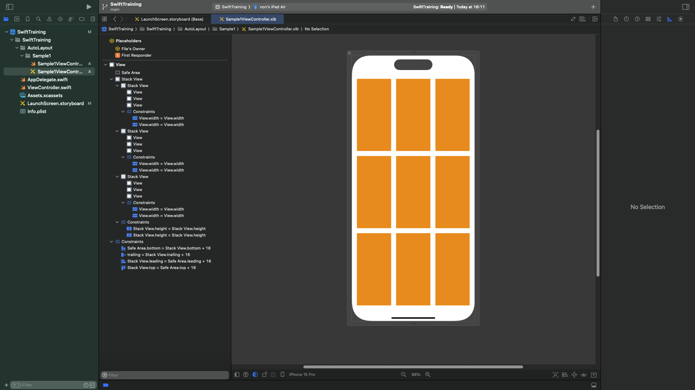
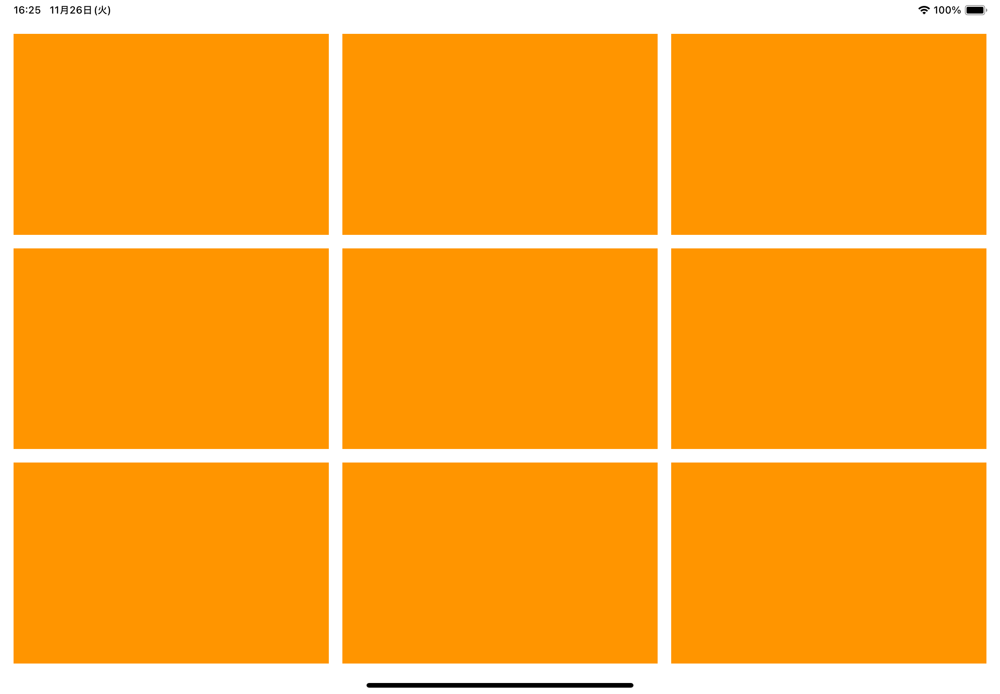
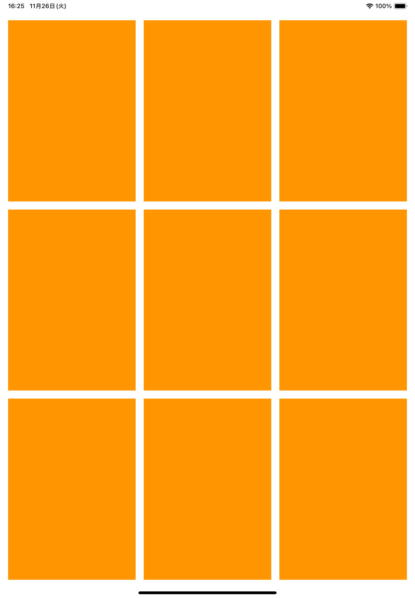

# AutoLayout

View のレイアウトを決定する仕組みのひとつに Auto Layout があります。  
制約(`NSLayoutConstraint`)を組み合わせて View のレイアウトを解決します。  
制約とは例えば`このViewの上辺は親のViewの上辺からXポイントあける`、`このViewとこのViewの幅は同じにする`
のようなものです。

Apple の Document  
[NSLayoutConstraint](https://developer.apple.com/documentation/uikit/nslayoutconstraint)  
[Auto Layout Guide](https://developer.apple.com/library/archive/documentation/UserExperience/Conceptual/AutolayoutPG/)

InterfaceBuilder で制約を与える方法、NSLayoutConstraint オブジェクトを使用してコードで制約を与える方法のほか、サードパーティのライブラリでコードから直感的に制約を与えられるものもあります。  
[SnapKit](https://github.com/SnapKit/SnapKit)

## 他の方法

iOS には他にもさまざまなレイアウトの指定方法がありますが、おおまかには AutoLayout とフレーム指定の 2 種類があります。フレーム指定にはフレーム指定のメリットがありますが、今回は全て AutoLayout でレイアウトを組むとさせてください。

# サンプル

1. UIView がグリッド上に並ぶレイアウト

横幅はマージンを除いた横幅の 1/3 とし、高さもマージンを除いた高さの 1/3 とする。なお開店してもこの比率は変わらないものとする

|縦|横|
|---|---|
|||

各 View は UIStackView の子 View として、横の並びを UIStackView に入れそれらをさらに UIStackView に入れることで実現する。UIView はそれぞれに等幅の制約をつけることで等間隔に配置する。

UIStackView に存在する Spacing にマージン幅(高さ)を入れることで自動的に View 間にはそのマージンが入る

縦に並んでいる UIStackView に関して同じ高さの制約をつけることでグリッド状のレイアウトを実現している

現在は等幅等高にしているがこの比率を変えることで、さまざまなレイアウトを組むことができる。(なおグリッド状のレイアウトを組むのであれば UICollectionView にするのが手っ取り早いというツッコミは無しである)
