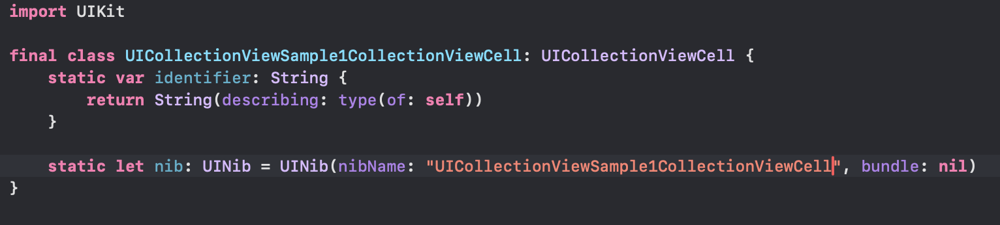
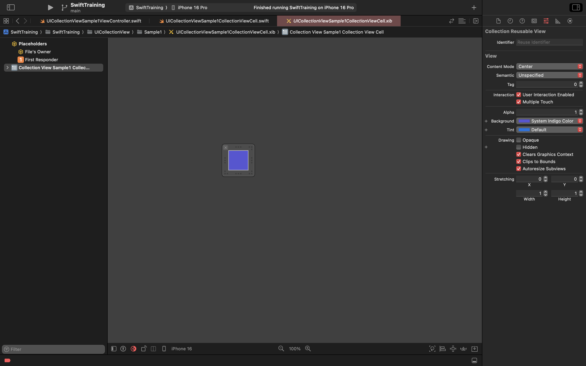

# UICollectionView

UICollectionView の解説をします。

UICollectionView は TableView よりさまざまなレイアウトを組めます。

UITableView は UICollectionView の一レイアウトに特化したコンポーネントと捉えることもできるかもしれません

スクロール方法を縦のみではなく横にも指定ができるので、大体 UICollectionView を使えばなんとかなります

また UITableView と同じで Section と row という概念があり、Section 毎にレイアウトを決めていくことができます

# UICollectionViewLayout

UICollectionView は Layout を組むためのクラスが用意されています。それが UICollectionViewLayout です。

ただ現在はそのサブクラスの UICollectionViewFlowLayout と UICollectionViewCompositionalLayout を使うためこの 2 つを解説していきます

## UICollectionViewFlowLayout

Section 毎の Inset、row のサイズ、row 間のマージン、改行される時のマージンなどを指定します。

これらは直接インスタンスに設定することもできますし、Delegate を通じて設定することもできます

## UICollectionViewCompositionalLayout

Section 毎の Inset、row のサイズ、row 間のマージン、改行される時のマージンなどを指定するところは一緒ですが、さらにさまざまなレイアウトを簡単に実装できるようになりました。

1 つ他の Layout との違いを挙げるとしたら Interface Builder で指定ができないのでほぼコード上で定義しなくてはいけない点です

# 例

## グリッド(FlowLayout)

AutoLayout で組んだレイアウトを UICollectionView でも組んでみましょう。

条件としては

- 横幅はマージンを除いた横幅の 1/3
- 高さもマージンを除いた高さの 1/3
- 回転してもこの比率は変わらない

とします。

今回は UICollectionViewController を使わず実装してみます

まずは UICollectionView を UIViewController に貼り付けて SafeArea に沿うように制約をつけます

IBOutlet で CollectionView と FlowLayout を繋げます

次は UICollectionViewCell を制作します。特に文字を入れるわけではないので分かりやすく背景色をつけるだけです

|                                                   |                                                  |
| ------------------------------------------------- | ------------------------------------------------ |
|  |  |

次に CollectionView には delegate、datasource、cell を登録します

FlowLayout では Section のマージン、cell 間のマージン、改行時のマージンを指定します

itemSize は、この時点では端末サイズがわからないので指定しません。

この時点でのコードはこんな感じです

余談ですが端末のサイズが決まるのは viewDidLayoutSubviews 以降のため、willSet が呼ばれるタイミング(loadView と viewDidLoad の間)ではまだ端末サイズは確定してません

では次に DataSource と Delegate の指定です。

DataSource では cell の数と cell を設定します。ここら辺は全く TableView と変わりません

次に Delegate で、itemSize を指定します。

この時 Delegate で渡される CollectionView を使って cell のサイズを計算します

画面幅からマージンを取り除いた横幅を 3 で割りましょう。詳しい計算方法は中学生数学なので割愛します。

高さも同様に計算をします

以下のようなコードを書きました

実行してみましょう

おや？なぜだか 2 列になってしまいました。これはなぜでしょうか？

UICollectionViewFlowLayout では Cell をスクロール方向の垂直方向にサイズと minimumInteritemSpacing を考慮して並べていきます。その際入り切らなかった Cell は改行をして配置されます

そのため考えられるのはサイズがおかしいことです。しかしロジックは正しそうに見えます。

ここで考えなければいけないのは除算による誤差です。必ずしも割り切れる数値ではない可能性が高いため、ここでは除算した結果のあまりを必ず切り捨てるようにしましょう

|                                            |                                            |
| ------------------------------------------ | ------------------------------------------ |
|  |  |

できました。しかしこのままでは回転した時にレイアウトが崩れてしまいます。

回転してみましょう。

グリッド状になってません。これは collectionViewDelegate で横幅を計算して返しているからです。(いわゆる AutoLayout を使ったレイアウトではないため)

そのため回転した時に collectionView に対してサイズの再計算を依頼する必要があります

collectionView の サイズを更新するには、 collectionView の collectionViewlayout の invalidateLayout を呼びます。これを呼ぶと CollectionView はサイズに関する Delegate を呼びます。

では回転したことはどのように検知すれば良いでしょうか？

いくつか方法はありますが、viewWillTransition(to:with:) を使うのが良いと思います。

この関数は ViewController のサイズが変わる際に呼ばれる関数です。

そのため回転だけでなく Multitasking(splitView や slideOver)の場合も使うことができます。

実装できました。

|                                             |                                           |
| ------------------------------------------- | ----------------------------------------- |
|  |  |

## バナーカルーセル(UICollectionViewCompositionalLayout)

個人的に CompositionalLayout が登場したことにより、すごく実装しやすくなったレイアウトとしてバナーカルーセルがあります。これを実装してみましょう

カルーセルについて知らない人は
| | |
| --- | --- |
| | |
