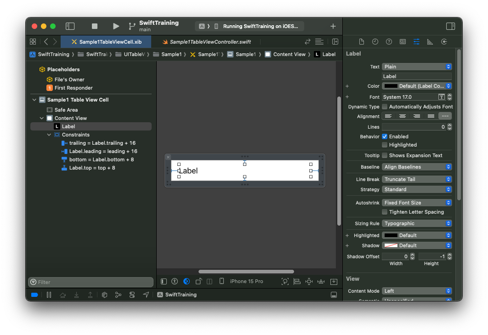
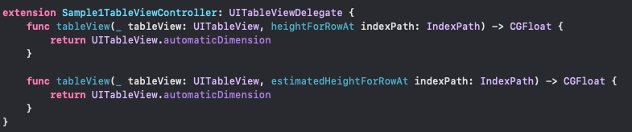
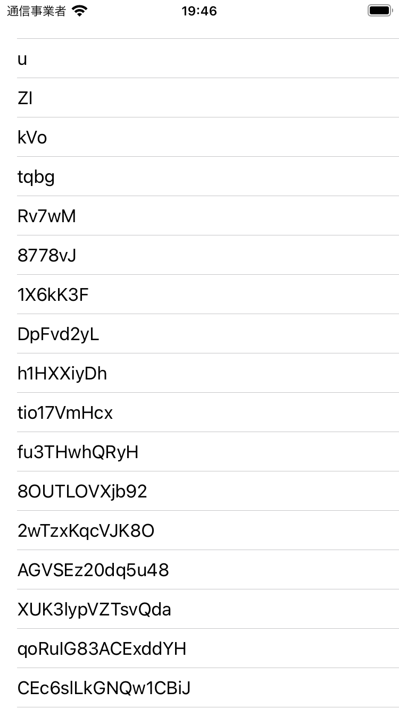
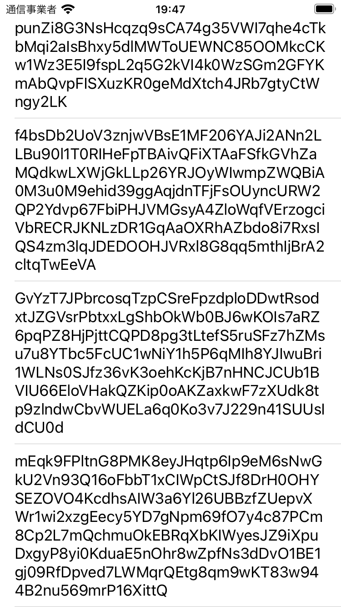

# UITableView

前項では一般的な UI コンポーネントの配置を考えました。

今ページでは UITableView の解説をします。

リストを作る際に使用するコンポーネントです。UIScrollView のサブクラスでもあるのでスクロールもできます。

UITableView は UITableViewCell を垂直方向に並べてリストを構成します。

各セルに何を表示するか各セルの高さを指定するのは DataSource や Delegate を用いて指定をします。

UITableView は section と row という概念で管理されています。いくつかの Cell(row)が集まり Section を構成しています。そのためざっくりと Section 毎にレイアウトを決定していくような感じで作るのがベストプラクティクスになります

<details>
<summary>よく使うプロパティやメソッド</summary>

- style
  <br>
  Plain、Grouped の二つが指定できる。それぞれ header が sticky するかどうか違いがあります。完成系をイメージして近い方を採用しましょう。

- sectionHeaderTopPadding
  <br>
  iOS15 から追加されたプロパティなのですが、初期値がなぜか 22.0。0 を指定してあげないと、セクションの上に謎の空白ができるので注意

- separatorStyle
  <br>
  セパレータを指定する。表示するなら singleLine。表示しないなら none

- separatorInset
  <br>
  セパレータの inset。デフォルトの場合セパレータが左から 22pt ぐらいマージンが入ってるが、ここで zero を指定してあげると、セパレータが横幅いっぱいまで伸びる

- allowsSelection
  <br>
  false に指定すれば、タップ判定を無効化できる。タップ時の強調もしなくなるため。見せるためのリストの場合はこれを false に設定するのがおすすめ

### Datasource

- tableView(\_:cellForRowAt:)
  <br>
  表示する Cell をここで作成し、返却します。Cell 内の要素の設定もここでします。UITableViewCell のインスタンスをいじるのはだいたいここです。どこのセルなのかは IndexPath を見て判断します

- tableView(\_:numberOfRowsInSection:)
  <br>
  セクションに表示する Cell の数を返します

- numberOfSections(in:)
  <br>
  セクションの数を返します

### Delegate

</details>

<br>

# 使い方

## UITableViewCell

UITableView では表示したい要素を Cell で表現をします。また Cell のインスタンスを生成する際は再利用して、不要になった(表示されなくなった)インスタンスを使い回します。

例えば 100 件あるリストを表示している際に、実際 100 個も Cell のインスタンスを生成してると、リストの要素数に応じて処理が遅くなったりメモリも食います。

そのため UITableView は実際に表示されている Cell だけをインスタンス生成し、スクロールで新たな Cell が表示される際に、画面外に消えていったインスタンスを再利用する仕組みが用意されています

```
dequeueReusableCell(withIdentifier:for:)
```

[参考文献](https://developer.apple.com/documentation/uikit/uitableview/1614878-dequeuereusablecell)

上記の関数は DataSource 内でのみ使用できることには注意が必要です。

## AutoResizing

UITableViewCell は正しく AutoLayout が組まれている場合、自動で高さを計算してくれる機能があります

UITableView の rowHeight に UITableViewDelegate.automaticDimension を指定してあげると自動で計算してくれます。

あるパターンとして文字列長が可変な文字列が複数個あるリストを考えます

以下のように UITableViewCell を用意します。UILabel の高さが決まれば、UITableViewCell の高さが決まるように制約をつけます。またラベルは Lines を 0 にすることを忘れないようにしてください

また表示する ViewController に Delegate を実装させましょう。そこで高さを決める関数内で UITableView.automaticDimension を返します。

|                                        |                                        |
| -------------------------------------- | -------------------------------------- |
|  |  |

残りのコードを書いて実行してみます。今回は 1 文字から 255 文字までランダムに文字列を出力してみました。

|                                        |                                        |
| -------------------------------------- | -------------------------------------- |
|  |  |

1 文字~では 1 行で済んでいますが、255 文字まで来ると数行までになっています。自動で高さが計算されていることがわかりますね。

### 余談

実は複数行の文字列がどれぐらいの範囲を取るかを得ることができる関数があります。

```
boundingRect(with:options:attributes:context:)
```

この関数を使えば、事前に文字列の高さがわかるので、これで Cell の高さを与える方法もよく使われます。
