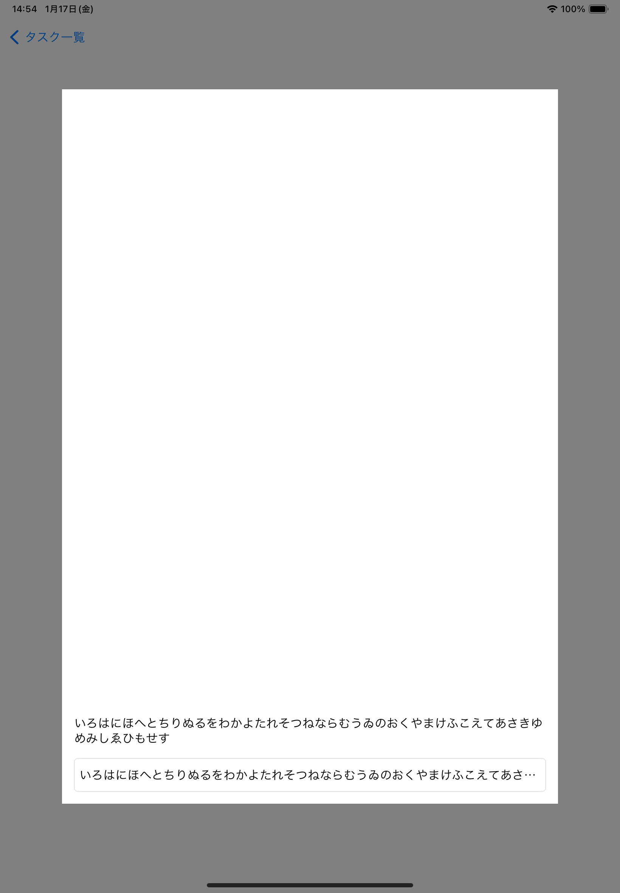

# 概要

今までのドキュメントを読んで、以下の課題をやってみましょう。

また以下の条件を前提として実装をしてください

1. 回転、Multitasking をした際にレイアウトが崩れないこと
1. iPhone および iPad でレイアウトが崩れずに表示されること

# 課題 1

入力フォームのある popup を作成してください。

viewController 内のボタンをタップすると表示されるようにしてください

以下が条件です

1. popup は中心に表示してください。
1. 横幅と縦幅はそれぞれ画面の 80%としてください。
1. popup の中身はテキストボックスと入力したテキストを表示するラベルを配置してください
1. popup 外はグレーアウトしてください。
1. テキストボックスタップ時にキーボードが出てくると思いますが、入力欄が表示されるように popup を移動させてください
1. 入力完了後にラベルに入力した内容を反映してください。
1. テキストボックスは 1 行分の高さで良いです。なおラベルは無限行としてください。popup からはみ出しそうな場合は省略するようにしてください
1. iOS 15 以降を想定して作成して良いです

デザインは以下のようになるようにしてください

iPhone
| | | | |
| --- | --- | --- | --- |
|  |  |  |  |
|  |  |  ||

iPad
| | | |
| --- | --- | --- |
|  |  |  |
|  |  |||

## ヒント

AutoLayout の[MinMax 指定](../AutoLayout.md#minmax-指定)の発展系です。

keyboard は view の keyboardLayoutGuide から取得ができるのでこいつを使ってうまくレイアウトを組んでみてください
